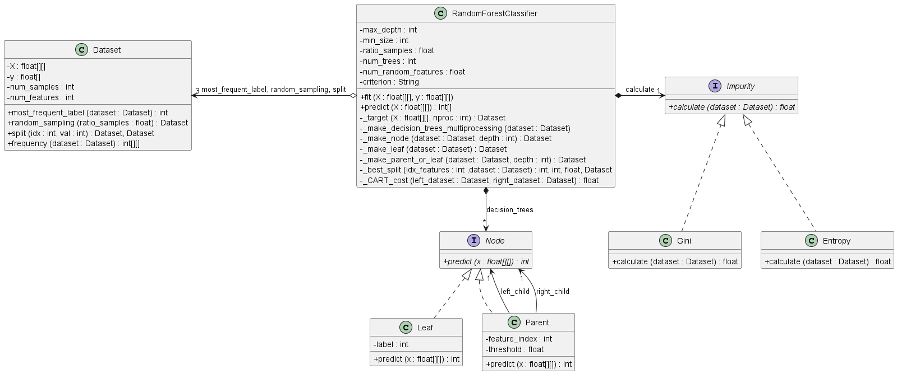

# Parallel Random Forest Classifier from Scratch

An optimized, object-oriented implementation of the Random Forest algorithm built entirely from scratch in Python. 

Unlike standard library implementations, this project deconstructs the logic behind Decision Trees and Ensemble Learning, using **Multiprocessing** to parallelize tree construction and **Design Patterns** to ensure modularity.


*Figure 1: UML Class Diagram of the implementation.*

## Key Features

* **Built from Scratch:** No high-level ML libraries (like Scikit-Learn) used for the model logic. Only `NumPy` is used for matrix operations.
* **Parallel Processing:** Uses Python's `multiprocessing` library to build decision trees concurrently, significantly reducing training time on multi-core CPUs.
* **Object-Oriented Design:**
    * **Composite Pattern:** Used for the Tree structure (`Node`, `Parent`, `Leaf`).
    * **Strategy Pattern:** Used for impurity calculations, allowing easy swapping between `Gini` Impurity and `Entropy`.
* **Customizable Hyperparameters:** Full control over tree depth, split size, sampling ratios, and more.

## Project Structure

* `main.py`: Entry point. Handles data loading (MNIST, Sonar, Iris), hyperparameter configuration, training, and accuracy evaluation.
* `random_forest_classifier.py`: The core class. Manages the ensemble of trees and distributes the training workload across processor cores.
* `dataset.py`: Wrapper class for data management, handling bootstrapping (random sampling) and feature splitting.
* `node.py`: Abstract base class defining the recursive structure of the decision trees.
* `impurity.py`: Mathematical implementations of cost functions (Gini Index and Information Entropy).

## Prerequisites

* Python 3.x
* Numpy
* Pandas
* Scikit-learn (Only used for fetching datasets, not for the model)

```bash
pip install numpy pandas scikit-learn
